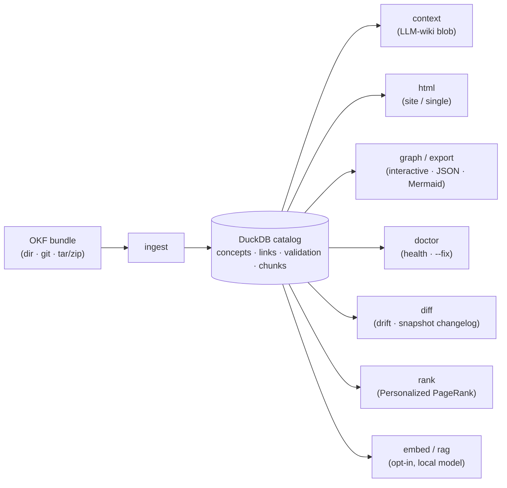

# foodini-okf-ingest

[](https://github.com/Foodini-NG/foodini-okf-ingest/actions/workflows/ci.yml)
[](#conformance-tests)
[](#deterministic-by-design--no-agents)
[](#install)
[](LICENSE)

> ### This is a fork
>
> **This file was modified by Foodini on 2026-08-22.** This repository is a
> Foodini fork of [**okf-ingest**](https://github.com/travisjakel/okf-ingest) by
> **Travis Jakel**, taken at commit `f3b58994` (release 0.11.0) and licensed
> under Apache-2.0. See [`NOTICE`](NOTICE) for attribution and the full list of
> changes.
>
> **What differs from the original.** The original ships five bindings — R,
> Python, Rust, C++ and MATLAB — held byte-identical by a shared conformance
> corpus. This fork keeps **Python only**, because Foodini does not write the
> other four and holding them in lockstep would cost several implementations
> per change. The catalog schema and the conformance corpus are retained
> unchanged. The distribution is `foodini-okf-ingest` and the command is
> `okf-ingest` (the original's bare `okf` collides with okf-generator).
>
> **This fork is independent.** Travis Jakel has not endorsed it and is not
> responsible for it. **Report problems with this fork here, never upstream.**
> If you want the original, multi-language tool, go
> [there](https://github.com/travisjakel/okf-ingest) — it is actively developed
> and it is the better choice unless you specifically want this reduced build.

A unified, open-source **ingestion tool for [Open Knowledge Format](https://github.com/GoogleCloudPlatform/knowledge-catalog) (OKF) bundles** — read any OKF bundle, validate its conformance (permissively, per the spec), build the concept graph, and load it into a portable, queryable **DuckDB catalog**. One catalog format, one idiomatic **Python** package.

> **Point it at your `[[wikilink]]` vault.** As of 0.6, okf-ingest resolves both
> markdown `](path)` links *and* `[[wikilink]]` references (Obsidian / Logseq /
> Foam) — by **name** (id / alias / title), so links **survive file renames**.
> Your existing notes become a deterministic, queryable, renderable knowledge
> graph with no rewriting. See [`[[wikilinks]]` & aliases](#wikilinks--aliases).


> The image is `okf-ingest graph` run on [okf-ingest's own docs](docs/okf-bundle/) — the
> project dogfoods OKF: that folder is a conformant bundle you can `ingest`,
> `html`/`graph`, and `doctor` with the tool itself.

OKF (Google Cloud; spec v0.2, v0.1 bundles fully supported) is a directory of markdown files with YAML frontmatter — one concept per file, markdown links as a graph. Validators and parsers already exist (Node, a web tool, a pure-Rust crate). **What no other tool does — and what this one is for — is load a bundle into a SQL-queryable DuckDB catalog with built-in semantic search (RAG) from Python**. See [Related tools](#related-tools).

## Deterministic by design — no agents

okf-ingest is **pure, deterministic machinery**: the same bundle in always
produces the same catalog, the same graph, the same clusters, and the same
rendered HTML out — byte-for-byte, on any machine, with no network and no API
key. **There are no LLM agents anywhere in it.** It never asks a model to
summarize a page, infer a "layer," guess a relationship, or decide anything. It
reads exactly the structure the author wrote — the frontmatter, the markdown
links — and surfaces *that*.

This is a deliberate line. A wave of tools will read your knowledge base by
turning agents loose to summarize and "understand" it; their output is
non-reproducible, costs tokens, ships your corpus to a model, and quietly
invents structure. okf-ingest does the opposite — it's the boring, auditable
substrate underneath:

- **Reproducible** — deterministic enough to assert on in CI; a parity test locks
  R and Python to byte-identical catalogs. No "re-ran it and got different
  edges."
- **Free & offline** — no tokens, no keys, no calls. Parsing, validation, the
  link graph, community clustering (deterministic label propagation), backlinks,
  impact, and HTML/graph rendering are all plain code.
- **Private** — your content never leaves the machine. Nothing is sent anywhere.
- **Composable with agents, not replaced by them** — when you *do* want an LLM,
  okf hands it the curated graph to reason over (`okf-ingest context`) rather than
  pretending to be the reasoner. You bring the model; okf brings the ground truth.

**The two honest exceptions**, both opt-in and explicit: the `embed`/`rag` layer
calls a *local, pluggable* embedding model (default Ollama — swap in your own) to
add vector search; and `ingested_at` is a wall-clock metadata field you can
override (the conformance suite does, which is how it stays byte-stable). The
knowledge representation itself — concepts, graph, clusters, render — is 100%
deterministic and model-free.

| | Wiki / docs site | Vector DB | Agent "understand my wiki" | **okf-ingest** |
|---|---|---|---|---|
| Reproducible (same in → same out) | ✅ | ⚠️ re-embed drift | ❌ non-deterministic | ✅ byte-locked |
| Offline, no API key / tokens | ✅ | ⚠️ | ❌ | ✅ |
| Content stays local / private | ✅ | ⚠️ | ❌ sent to a model | ✅ |
| SQL / programmatic access | ❌ | ⚠️ vectors only | ⚠️ | ✅ DuckDB |
| Explicit concept graph | ⚠️ implicit | ❌ | ✅ inferred | ✅ author-written |
| Your `[[wikilink]]` notes → queryable graph | ⚠️ renders only | ❌ ignores links | ⚠️ non-deterministic | ✅ + rename-safe |
| Renders to HTML + interactive graph | ⚠️ | ❌ | ✅ | ✅ |
| Semantic search | ❌ | ✅ | ✅ | ✅ (opt-in) |
| Invents structure with an LLM | ❌ | ❌ | ✅ | ❌ by design |

### How it fits together



## Do you actually need RAG?

Often you don't — by design. OKF bundles are meant to be read *directly* by an
agent: load `index.md`, follow the curated links, pull the few relevant concept
files into context. For a small, well-linked bundle (dozens to low-hundreds of
concepts), that index-first traversal is the intended pattern — cf. Karpathy's
"LLM wiki"; Google's own framing is that OKF **complements** RAG, it doesn't
require it. No catalog, no embeddings, no okf-ingest — just let the agent
navigate the markdown.

Reach for okf-ingest when direct reading isn't enough:

- **Programmatic / SQL access** (any size) — query concepts, the link graph, or
  conformance findings from code or CI, in R or Python. → the DuckDB catalog.
- **Large bundles** — thousands of concepts, where loading the index or the whole
  bundle into context isn't practical.
- **Semantic / cross-corpus retrieval** — feeding OKF into a wider RAG pipeline,
  or similarity search over a big/heterogeneous knowledge base. → the optional
  `embed`/`rag` layer.

For small curated bundles, **skip `embed`/`rag`** — the explicit graph the author
wrote beats fuzzy vector matches, and following links costs nothing. If you want
tooling *for* that wiki pattern (rather than against it), use
[`okf-ingest context`](#context--the-index-first-no-embeddings-primitive): it assembles
the index-first, link-following slice for an agent to read directly — no
embeddings involved.

## Quickstart

Install from a clone (see [Install](#install)), then:

```bash
uv pip install -e ".[html]"    # from a clone; see Install

okf-ingest ingest ./my-bundle --db kb.duckdb      # dir, git URL, or tar/zip
okf-ingest embed  kb.duckdb
okf-ingest rag    kb.duckdb --query "how is revenue computed?" -k 5
# [0.71] metrics/revenue.md#1 — Revenue
# [0.64] orders.md#1 — Orders
```

The catalog is plain DuckDB — query it from Python, or with the bare `duckdb`
CLI, or anything else that speaks DuckDB.

## Use it from an AI agent

okf is deterministic and **composes with your agent** — give the agent the graph,
let it reason. Drop this into your agent's instructions
(`AGENTS.md` / `CLAUDE.md` / Cursor rules) so it drives okf instead of grepping:

```
The docs at <PATH> are an OKF bundle. Use `okf-ingest` to navigate them:
- `okf-ingest context <PATH> --start <concept>.md --depth 1` → index.md + that concept +
  its linked neighbours as one markdown blob. Read that; don't grep files ad hoc.
- `okf-ingest query <PATH> --search "<term>"` (substring) or `--sql "<SELECT…>"` for lookups.
Start from index.md to see the map.
```

That's it — one paste and the agent reads the bundle index-first, the way OKF is
meant to be consumed (`okf-ingest` runs locally; no data leaves the machine). For
semantic instead of substring lookup, ingest once (`okf-ingest ingest <PATH> --db kb.duckdb`),
`okf-ingest embed kb.duckdb`, then point the agent at `okf-ingest rag kb.duckdb --query "…"`. See
[`context`](#context--the-index-first-no-embeddings-primitive).

## The core is a contract, not compiled code

Two language-neutral artifacts define behaviour, and this fork keeps both unchanged:

1. **`schema/catalog.sql`** — the DuckDB catalog schema. You can query the catalog with the bare `duckdb` CLI, no library at all, and a catalog written here is readable by any conformant implementation of OKF ingestion — including the original's other bindings.
2. **`conformance/`** — language-agnostic golden bundles plus expected outputs that the implementation must reproduce, including a `content_hash` parity lock and a hidden-directory guard.

In the original these existed to hold five independent implementations byte-identical. Here there is one implementation, so they serve as a **behavioural regression gate** instead — and an unusually strict one, precisely because every asserted value had to be reproducible in five languages. Any change that moves a conformance-asserted value must update the expected JSON deliberately and say why.

## What it enforces (and tolerates)

Per OKF §6, a bundle is **conformant** iff every non-reserved `.md` has parseable YAML frontmatter with a **non-empty `type`** (a free string — no enum). Everything else is permissive: missing recommended fields, unknown types/keys, broken links, and missing `index.md` produce **findings, never rejection**. See [`docs/SPEC_NOTES.md`](docs/SPEC_NOTES.md).

## Install

Python **3.14+**. The project is uv-managed and is not published to any index —
install from a clone.

```bash
git clone git@github.com:Foodini-NG/foodini-okf-ingest.git
cd foodini-okf-ingest
uv venv --python 3.14
uv pip install -e ".[html]"
```

That puts the **`okf-ingest`** command on PATH inside `.venv`, plus the
importable `okf` package. The `[html]` extra adds the markdown engine for
`okf-ingest html`; embeddings and `rag` use a local Ollama server by default and
need no extra Python dependency (the embedder is pluggable — see
[Semantic search](#semantic-search-rag)).

Without installing: `PYTHONPATH=src python -m okf …`.

> The command is **`okf-ingest`**, not `okf`. Both OKF tools claimed the bare
> `okf`, so on a machine with okf-generator installed `okf --help` could run the
> other tool. Renaming it is one of this fork's changes.

## Usage

```python
import okf.okf as okf
con, summary = okf.ingest("path/to/bundle", db_path="catalog.duckdb")
okf.search(con, "revenue")
```

Both produce the same `okf_bundle / okf_concept / okf_link / okf_validation` tables.

### Semantic search (RAG)

> Optional, and overkill for small curated bundles — see
> [Do you actually need RAG?](#do-you-actually-need-rag). It pays off for large
> or cross-corpus knowledge bases, not a hand-linked folder of a few dozen concepts.

`embed` chunks concept bodies (paragraph-merged to ~600 chars), embeds each via
a **pluggable embedder** (default: local Ollama `nomic-embed-text`, 768-dim;
swap in any `texts -> list[vector]` callable), and stores vectors in `okf_chunk`.
`rag` embeds a query and ranks chunks by cosine similarity using DuckDB's native
`list_cosine_similarity` — **no vector-DB extension required**. Embeddings are
part of the shared catalog, so you can embed with one binding and query with the
other.

## Without the catalog — the lean parse / lint / graph layer

The DuckDB catalog is the *queryable materialization*; it isn't on the critical
path for parsing, linting, or graphing a bundle. If you don't want to touch
DuckDB at all, three functions hand you the whole model as plain data structures
(R: data frames / lists; Python: dicts / dataclasses) and **never go through the
catalog**:

| | R | Python | Rust | Gives you |
|---|---|---|---|---|
| Parse | `okf_read()` | `read_bundle()` | `read_bundle()` | concepts (frontmatter + body) |
| Lint / health | `okf_validate()` | `validate()` | `validate()` | the *same* findings `doctor` reports — broken links, orphans, missing fields, non-ISO timestamps |
| Graph | `okf_links()` | `links()` | `links()` | resolved + broken edges (markdown **and** `[[wikilinks]]`) |
| Diff | `okf_diff(a, b)` | `diff(a, b)` | `diff(a, b)` | dir-vs-dir changelog (concepts, types, edges) — the catalog only enters if a side *is* one |

```r
rd  <- okf_read("my-bundle")        # no DuckDB
val <- okf_validate(rd)             # data.frame of findings (broken_link, orphan, …)
lk  <- okf_links(rd)                # src_path / dst_raw / dst_path / resolved
subset(lk, !resolved)               # every dangling link, as data — your call what to do
```

```python
b   = okf.read_bundle("my-bundle")  # no DuckDB
val = okf.validate(b)               # list of findings
lk  = okf.links(b)                  # the edge graph
[e for e in lk if not e["resolved"]]
```

```rust
// The Rust crate IS this layer (plus rank/seeds/diff/fetch), catalog-free:
let ing = okf_ingest::ingest("my-bundle")?;   // summary + findings + links in memory
let broken: Vec<_> = ing.links.iter().filter(|l| !l.resolved).collect();
```

Reach for the catalog (`okf_ingest`) when you want what a SQL engine is *for*:
SQL `query`, the rendered `html`/`graph`, `context` blobs, or vector `rag`. So
DuckDB is effectively opt-in by usage — build it when you need it, ignore it when
you don't.

## CLI

After install, `okf-ingest …` (the console script). Without installing,
`PYTHONPATH=src python -m okf …` takes the same arguments.

```bash
okf-ingest validate <bundle> [--strict] [--json]      # lint; exit 1 on errors (or warnings w/ --strict)
okf-ingest ingest   <source> --db catalog.duckdb [--subdir <p>] [--branch <b>] [--incremental] [--json]
okf-ingest query    catalog.duckdb [--sql "…"] [--search <term>] [--concepts|--links|--findings] [--json]
okf-ingest context  <bundle|catalog> [--start <concept>] [--depth N] [--max-tokens N]  # LLM-wiki context blob
okf-ingest html     <bundle|catalog> --out <dir> | --single <file.html> [--title T]    # render for viewing
okf-ingest graph    <bundle|catalog> --out <file.html> [--title T]                     # interactive force-directed graph
okf-ingest export   <bundle|catalog> [--json]                      # portable {nodes, edges} graph JSON
okf-ingest impact   <bundle|catalog> <concept> [--json]            # inbound / outbound / transitive ripple
okf-ingest rank     <bundle|catalog> <concept> [-k N]              # Personalized PageRank relevance to a concept
okf-ingest diff     <a> <b> [--json]                               # concept-level changelog; each side a bundle dir or catalog
okf-ingest embed    catalog.duckdb [--model nomic-embed-text] [--incremental]  # chunk + embed bodies for search
okf-ingest rag      catalog.duckdb --query "…" [-k 5] [--model …]  # top-k semantic matches
```

### `context` — the index-first, no-embeddings primitive

`context` is the faithful OKF / "LLM wiki" consume operation: hand an agent
`index.md` plus a concept and its **link-neighborhood**, assembled into one
markdown blob to read directly. It walks the concept graph you already built —
**no embeddings, no vector search** — and is capped to a token budget. This is
the on-concept alternative to `rag` for curated bundles:

```bash
okf-ingest context ./my-bundle --start orders.md --depth 1 --max-tokens 8000 > ctx.md
# emits index.md + orders.md + everything one link away, ready to paste into a prompt
```

It accepts a bundle directly (dir/git/tar/zip) or an ingested `.duckdb` catalog.

### `html` — render a bundle for viewing

`html` is a thin "render for viewing" layer: turn a bundle into browsable HTML
with **no build step, no JavaScript, inline CSS** — copy the output anywhere and
open it. Two modes:

```bash
okf-ingest html ./my-bundle --out site/            # navigable site: one .html per concept + index.html
okf-ingest html ./my-bundle --single bundle.html   # one self-contained file (concepts become anchored sections)
```

Internal `.md` links are rewritten to **page-relative** `.html` (site) or
in-page `#anchors` (single), so the result works straight off the filesystem
(`file://`) however the source wrote its links. Each page gets a metadata bar
(type / status / timestamp / tags), a **"Linked from"** backlinks line, and a
footer badge that surfaces broken or orphan links from `validate`. Bodies render
via a thin markdown engine (R `commonmark`, a Suggests dep; Python `markdown` via
the `okf-ingest[html]` extra). Like `context`, it accepts a bundle
(dir/git/tar/zip) or a `.duckdb` catalog.

### `graph` / `export` / `impact` — the concept graph, surfaced

The catalog already holds the link graph; these expose it (all **deterministic**,
no LLM):

```bash
okf-ingest graph  ./my-bundle --out graph.html   # interactive force-directed page (vanilla JS, no CDN)
okf-ingest export ./my-bundle > graph.json       # portable {nodes, edges} for any external visualizer
okf-ingest impact ./my-bundle signals/x.md       # outbound / inbound / transitive ripple of a concept
```

`graph` is a single self-contained HTML page — pan/zoom/drag, type-to-search,
nodes coloured by OKF type with community clustering as the fallback (a
deterministic label-propagation, [`okf_clusters`]). Click a node to open its
rendered `.html`, so dropping `graph.html` into a `html --out` site root turns it
into a live map. `export` emits the same node/edge model as JSON (nodes carry
`id`/`type`/`title`/`tags`/`cluster`/`href`), extending the "core is a contract"
idea beyond the DuckDB catalog. `impact` answers "what does changing this ripple
to" from the resolved-link graph.

### `--incremental` — re-ingest / re-embed only what changed

`ingest --incremental` diffs each concept's `content_hash` against a prior ingest
into the same `--db`, rewriting only changed/added concepts (and dropping removed
ones); the JSON summary reports `changed`/`added`/`removed`/`cached`. `embed
--incremental` re-embeds only concepts whose content changed, skipping the
expensive embedder calls for the rest — the right default for large, often-edited
wikis.

### `doctor` — ongoing health & maintenance

Knowledge bases drift — links break when files move, timestamps go stale,
concepts orphan. `okf-ingest doctor` is a deterministic one-shot health scan with a
score and CI exit codes:

```bash
okf-ingest doctor ./my-bundle                  # health: 92/100 (broken links, orphans, stale ts, dup titles…)
okf-ingest doctor ./my-bundle --strict         # exit 1 on any warning — drop into CI / a hook
okf-ingest doctor ./my-bundle --stale-days 365 # also flag timestamps older than a year
okf-ingest doctor ./my-bundle --fix            # apply ONLY safe repairs, report each
```

`doctor` also flags `duplicate_identity` (one id/alias claimed by two
concepts — breaks `[[wikilink]]` resolution) and, at info level (never hurts
the score), `hub_concentration` (pages whose links mostly point at hubs).
Pages marked **`reviewed: true`** in frontmatter are human-validated:
`doctor --fix` never touches them.

`--fix` is conservative on purpose — it only normalizes a parseable non-ISO
`timestamp`, and re-points a broken link when *exactly one* basename matches.
Anything ambiguous is reported, never guessed (no LLM). Ready-made
[`examples/pre-commit`](examples/pre-commit) and
[`examples/github-action.yml`](examples/github-action.yml) wire it into your
workflow so a bundle can't drift broken.

### `rank` — relevance, from the graph the author wrote

`okf-ingest rank` scores every concept's relevance to a start concept with
**Personalized PageRank** — computed by *exact power iteration*, not
Monte-Carlo sampling, so it is fully deterministic like everything else here.
No embeddings, no model: the signal is the link structure the bundle's author
already encoded.

```bash
okf-ingest rank ./my-bundle orders.md            # what matters most to orders.md, ranked
okf-ingest context ./my-bundle --start orders.md --rank ppr   # budget-fill context by relevance
```

`context --rank ppr` upgrades neighborhood selection from BFS ("everything at
depth 1 is equal") to relevance-weighted — on hub-heavy wikis the pages that
actually matter to the topic fill the token budget first instead of whatever
the hub happens to link. A conformance fixture locks R and Python to
byte-identical scores. (Programmatic: `okf_rank()` / `okf.graph.ppr()`.)

Measured, not asserted — [`bench/`](bench/) runs a leave-one-link-out
retrieval benchmark on real corpora: on a hub-heavy living wiki,
query-seeded exact PPR nearly doubles BFS recall (R@5 0.29 → 0.54) and
matches local vector embeddings with zero embedding infrastructure, while a
Monte-Carlo PPR baseline changes 7–24% of its top-5 between identical runs —
exact power iteration is bit-stable at milliseconds per query. Full tables
and honest caveats in [`bench/README.md`](bench/README.md).

**Don't know which concept to start from? Ask a question.** `context --query`
is the full hybrid cascade, still with zero models: deterministic lexical
seed selection (`okf_seeds()`: +3 title / +2 description·tags / +1 body per
query token) → multi-seed PPR weighted by those scores → relevance-filled
context:

```bash
okf-ingest context ./my-bundle --query "how is revenue computed?" --max-tokens 4000
```

### `diff` — what changed, as knowledge structure

`git diff` shows text hunks; `okf-ingest diff` shows what changed as **knowledge
structure**: concepts added / removed / changed (by `content_hash`),
frontmatter `type`/`title` changes, and graph deltas — edges added/removed,
links newly broken or fixed. Each side can be a bundle directory *or* an
ingested `.duckdb` catalog, which gives you both shapes for free:

```bash
okf-ingest diff catalog.duckdb ./my-bundle     # DRIFT: what changed since the last ingest
okf-ingest diff ./snapshot-old ./snapshot-new  # SNAPSHOT: changelog between two versions
```

```
concepts: +1 added / -1 removed / ~2 changed (1 unchanged), type-changed 1, retitled 1
  + delta.md
  - gamma.md
  ~ beta.md
  ~ alpha.md  type: Signal -> Dataset
links: +2 added / -1 removed, newly broken 1, fixed 1
  ! beta.md -> gone.md (now broken)
```

Like everything in the core it's deterministic — pure hash/set comparison,
output sorted by path, no model, no wall clock — and exits `0` when identical,
`1` when different, so `okf-ingest diff` drops straight into CI as a change gate the
same way `doctor` gates health. (Programmatic: `okf_diff(a, b)` in R,
`okf.diff(a, b)` in Python; both also accept an open connection or an
`okf_read()` bundle.)

### `[[wikilinks]]` & aliases

Alongside markdown `](path.md)` links (resolved by path, unchanged), okf-ingest
resolves `[[wikilink]]` references — `[[Concept Name]]` and `[[name|display]]` —
by **name**, trying `id` → `alias` → `title` → filename-stem (ambiguous names
resolve to nothing, never a guess). Add `aliases: [Alt Name]` and an optional
`id:` to a concept's frontmatter to give it stable handles. This makes
okf-ingest work on Obsidian / Logseq / Foam-style vaults out of the box, and —
because links target a name, not a path — they survive file renames. Existing
markdown-only bundles are byte-identical; wikilinks are purely additive.

A `<source>` is a local directory, a **git URL** (github/gitlab/bitbucket, `.git`,
or `git@`), or a **tar/zip archive** (local path or `http(s)` URL). Remote sources
are fetched to a temp dir and cleaned up automatically; `--subdir` selects a
bundle within a repo/archive and `--branch` picks a git ref:

```bash
okf-ingest ingest https://github.com/org/repo.git --subdir docs/okf --db kb.duckdb
okf-ingest ingest https://example.com/bundle.tar.gz --db kb.duckdb
```

`validate` is CI-friendly (non-zero exit = non-conformant). The catalog is a
plain DuckDB file and the schema is the interop contract, so anything that
speaks DuckDB can read it — including the bare CLI:

```bash
okf-ingest ingest ./bundle --db cat.duckdb
duckdb cat.duckdb -c "SELECT path, title FROM okf_concept ORDER BY path"
```

## Conformance tests

```bash
python conformance/check_py.py      # vs conformance/expected/*.json — must print PASS
```

Stdlib-only and standalone. It gates every change; CI runs it on every push and
pull request.

## Layout

```
pyproject.toml          the package: foodini-okf-ingest, console script okf-ingest
src/okf/                the implementation (okf.py, cli.py, graph.py, html.py,
                        doctor.py, diff.py, rag.py)
schema/catalog.sql      the catalog schema (interop contract) — unchanged from upstream
conformance/            golden bundles + expected outputs + check_py.py (the gate)
docs/                   ARCHITECTURE.md, SPEC_NOTES.md, okf-bundle/ (dogfood)
bench/                  retrieval benchmark + published results
examples/               a GitHub Action and a pre-commit hook
NOTICE                  attribution and the list of changes from upstream
```

## Status

**Stable feature surface · maintained by Foodini for Foodini's use.** The whole
consume side is implemented, CLI-wrapped and conformance-tested over one
portable DuckDB catalog: **validate → ingest → query → context → render
(`html` / `graph` / `export --mermaid`) → `impact` → `rank` → `doctor` → `diff`
→ embed → rag**, with `--incremental` ingest/embed and dir/git/tar/zip sources.

The feature surface came from upstream complete and the conformance contract is
locked, so behaviour is stable. What this fork does *not* offer is a general
support commitment: it exists to serve Foodini's knowledge pipeline, it is not
published to any package index, and it will diverge from upstream over time.
Issues and PRs from outside Foodini are welcome but will be judged on whether
they help that purpose. If you want the general-purpose tool, use
[the original](https://github.com/travisjakel/okf-ingest).

## Roadmap

- **Authoring** (`new` / `add`) — scaffold conformant concepts. Deliberately not
  done yet; okf-ingest is consume-first (for authoring today, see
  [`okf-knowledge`](https://github.com/sniperunder123/okf-knowledge)).
- **`watch`** — re-ingest/render on file change for live editing.
- **HTML polish** — optional sidebar nav and theme palettes (the page stays
  no-JS, inline-CSS).
- More `doctor --fix` classes, as long as they stay unambiguously safe.

## FAQ

**Is anything sent to an LLM?** No — not by the core. The only model calls are
the opt-in `embed`/`rag` layer, and that's a *local* embedder (Ollama by
default) you can swap. Parsing, the graph, clusters, rendering, and `doctor` are
plain deterministic code. See [Deterministic by design](#deterministic-by-design--no-agents).

**R or Python — which catalog do I get?** The same one. Both write byte-identical
DuckDB catalogs (a parity test enforces it); ingest in one, query from the other.

**Do I need embeddings/RAG?** Usually not for small curated bundles — the graph
the author wrote beats fuzzy matches, and `okf-ingest context` costs nothing. See
[Do you actually need RAG?](#do-you-actually-need-rag).

**How do I keep a bundle healthy over time?** `okf-ingest doctor` (+ the
[`examples/`](examples/) pre-commit hook / GitHub Action) gates drift in CI;
`--fix` repairs the unambiguously-safe issues.

**Does it author/edit my knowledge?** No. It reads what you wrote. `doctor --fix`
makes only mechanical, reported repairs (ISO timestamps, unique-match moved
links) — never content.

**What's "conformant"?** Parseable frontmatter with a non-empty `type` on every
non-reserved file. Everything else is a finding, never a rejection.

**Contributing?** See [CONTRIBUTING.md](CONTRIBUTING.md) — new bindings just need
to reproduce the conformance corpus.

## Related tools

The OKF tooling ecosystem appeared within weeks of the v0.1 spec. okf-ingest is
deliberately positioned where the others aren't — a queryable catalog + RAG, in
R and Python:

| Tool | Lang | Validate | Parse/graph | `[[wikilinks]]` | Queryable store | Embeddings / RAG |
|------|------|:--:|:--:|:--:|:--:|:--:|
| `GoogleCloudPlatform/knowledge-catalog` | Py/TS | — | producer + HTML viz | — | — | — |
| `W4G1/okf` | Rust | ✓ | ✓ | — | — | — |
| `sniperunder123/okf-knowledge` | Python (Claude Code skill) | ✓ | ✓ + **authoring & graph viz** | — | — | — |
| WitsCode / okf.site | Node/web | ✓ | partial | — | — | — |
| okf-skills / okf-skill | agent skills | ✓ | ✓ | — | — | — |
| **okf-ingest** (this) | **R + Python** | ✓ | ✓ | **✓ rename-safe** | **DuckDB catalog** | **✓** |

okf-ingest sits on the **consume** side of the OKF lifecycle. For the **produce**
side — authoring, maintaining, and visualizing bundles (especially inside Claude
Code) — [`okf-knowledge`](https://github.com/sniperunder123/okf-knowledge) is a
nice complement: curate a bundle there, then `okf-ingest ingest` it into a queryable
DuckDB + RAG catalog here. If you only need to lint a bundle, the Rust/Node
validators are great.

## License

Apache-2.0, unchanged from the original work. See [`LICENSE`](LICENSE) for the
licence text and [`NOTICE`](NOTICE) for attribution to Travis Jakel, the fork
point, and the list of modifications. Files modified by Foodini carry a notice
saying so, per Apache-2.0 section 4(b).
